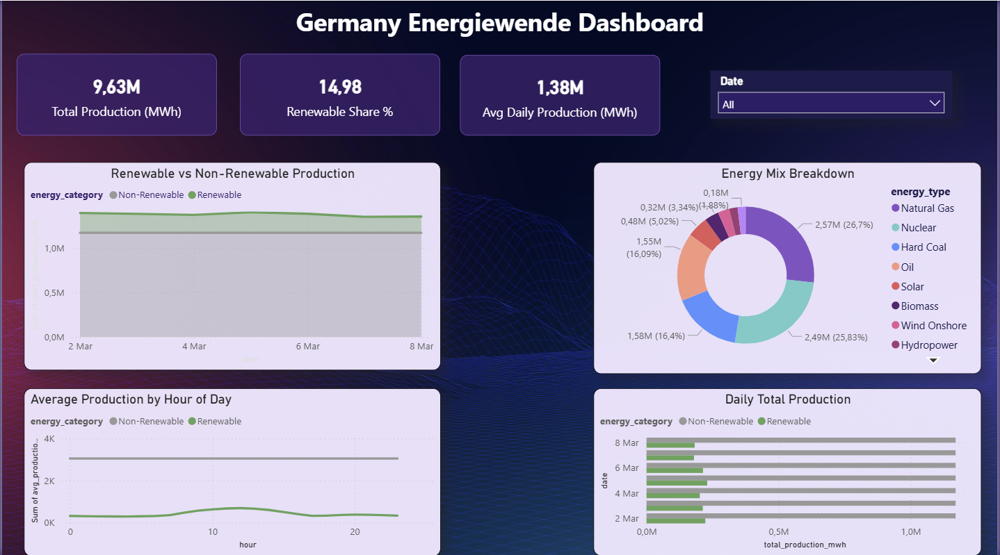

# Germany Energiewende Data Pipeline

An end-to-end data pipeline that ingests real-time German electricity generation data from the official SMARD API, models it across three models in PostgreSQL and visualise the results in PowerBI.

## 📚 Overview
This project is an end-to-end data pipeline tracking Germany's electricity generation as part of the national Energiewende (energy transition) policy. Real time German electricity generation data is ingested from Germany's official SMARD API, modeled across 3 layers in PostgreSQL, and visualized in a Power BI dashboard. This project shows core data engineering skills including API ingestion, SQL modeling, pipeline orchestration, and business intelligence reporting.

## 📊 Dashboard

## ⚡What is Energiewende?
Germany's national energy transition policy is shifting from fossil fuels and nuclear power to renewable energy sources. This projects tracks the generation of electricity across nine energy source including wind, solar, gas and coal.

## ⚙️ Features
* End-to-End pipeline: Covers the full data journey from API ingestion to dashboard visualization.
* 3-Layer SQL Model: Raw, staging and mart layers.
* Real-time government data: Official German electricity data from Bundesnetzagentur
* Automated Orchestration: Single pipeline scheduled to run everyday at 6 am.
* Interactive Dashboard: Power BI dashboard with KPI cards, data slicer and four analytical charts.

## 🔑 System Requirements
* Operating system: Windows 10 or later, macOS, or Linux
* Python: Version 3.8 or later
* Database: PostgreSQL 14 or later
* Visualisation: PowerBI desktop
* Hardware: At least 4 GB of RAM and 1 GB of available disk space

## 🌐 Data Source
Data is sourced from SMARD — the official electricity data platform of the Bundesnetzagentur (German Federal Network Agency).
* Updated every 15 minutes
* All German electricity generation sources
* Free and publicly available
* Source: https://www.smard.de

## 📐 Architecture
SMARD API (official German government electricity data)
      ↓
Python Ingestion (fetch_smardapi.py)
      ↓
PostgreSQL — 3 layer model
  ├── raw_energy        (6,048 rows-original API data)
  ├── staging_energy    (cleaned data)
  ├── mart_daily        (daily data)
  └── mart_hourly       (hourly data)
      ↓
Power BI Dashboard

## 🚀 Getting Started
To get started with this project, follow these steps:
1. Clone the repository: Download the project to your local machine
2. Install python dependencies: Set up a virtual environment and install libraries
3. Set up PostgreSQL: Create the database and raw_energy table
4. Configure credentials: Create your `.env` file with database details
5. Run the pipeline: Execute the pipeline script to fetch and model data
6. Open PowerBI: Connect to PostgreSQL and explore the dashboard

## 📈 Key Insights
* Natural Gas and Nuclear are major energy sources of Germany.
* Solar peaks between hours 10-14, dropping to zero at night.
* Biomass is the most consistent renewable source.
* Renewable share is approximately 15% for the analyzed period.
* Germany still relies on fossil fuels for 85% of electricity generation.
* Nuclear energy remains significant despite Germany's official phase-out policy.